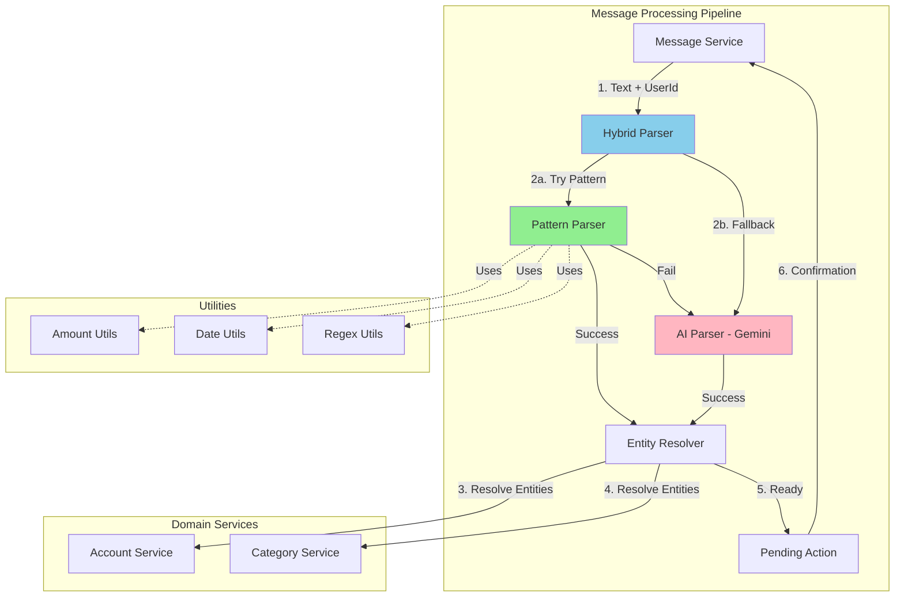
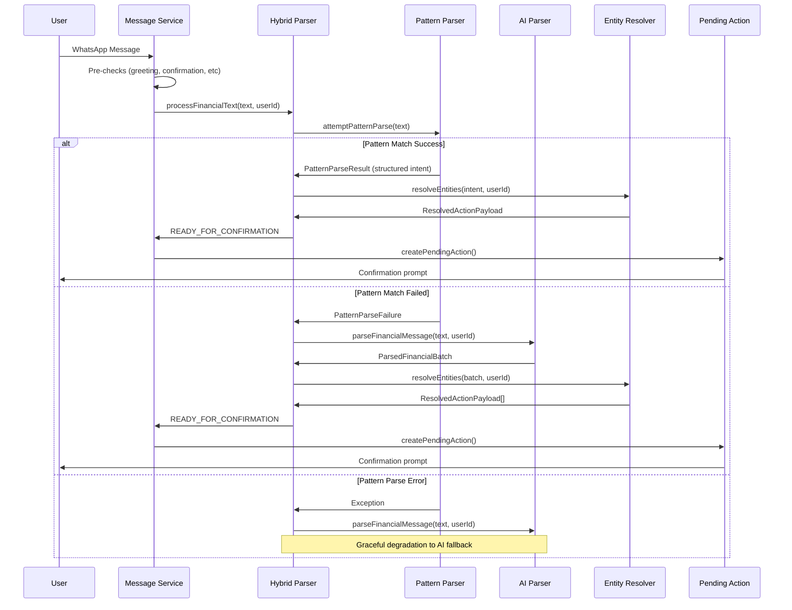

# Design Document: Hybrid Parser Optimization

## Overview

The Hybrid Parser Optimization introduces a two-tier parsing architecture that dramatically improves WhatsApp bot performance by routing simple, structured commands through fast deterministic pattern matching while preserving AI-based natural language understanding for complex cases.

**Core Architecture:**
- **Pattern Parser**: Deterministic regex-based parser for common transaction formats (80%+ of messages)
- **AI Parser**: Existing Gemini-based FinancialParserService for complex/ambiguous inputs
- **Hybrid Orchestrator**: Intelligent router that attempts pattern matching first, falls back to AI only when needed

**Performance Impact:**
- 70-90% latency reduction for common commands (250ms → 25ms average)
- 80%+ reduction in AI API costs
- Zero external dependency for routine operations
- Backward-compatible integration with existing message processing pipeline

**Design Principles:**
1. **Fail-Fast Pattern Matching**: Pattern parser returns early on any ambiguity
2. **Graceful Degradation**: AI fallback ensures no functionality loss
3. **Interface Preservation**: Hybrid parser implements same contract as AI parser
4. **Observability-First**: Comprehensive metrics for optimization validation

---

## Architecture

### High-Level Component Diagram



### Data Flow Sequence



---

## Components and Interfaces

### 1. Pattern Parser Service

**Location:** `services/ai/pattern-parser.service.ts`

**Responsibilities:**
- Deterministic pattern matching for expense, income, budget allocation commands
- Amount normalization (rb, ribu, k, jt, juta → numeric)
- Date extraction (kemarin, hari ini, tadi → Date objects)
- Account and category hint extraction
- Fast-fail on ambiguity or complexity

**Interface:**

```typescript
export interface PatternParseResult {
  success: true;
  intent: PatternParsedIntent;
  parseMethod: 'PATTERN';
  processingTimeMs: number;
}

export interface PatternParseFailure {
  success: false;
  reason: 'NO_MATCH' | 'AMBIGUOUS' | 'MULTI_ACTION' | 'COMPLEX_DATE' | 'INVALID_FORMAT';
  fallbackRequired: true;
}

export type PatternParseAttempt = PatternParseResult | PatternParseFailure;

export interface PatternParsedIntent {
  intent: 'EXPENSE' | 'INCOME' | 'BUDGET_ALLOCATION';
  amount: number;
  description: string;
  transactionDate: string; // ISO date string YYYY-MM-DD
  accountHint?: string | null;
  categoryHint?: string | null;
  categoryName?: string; // For BUDGET_ALLOCATION only
}

export class PatternParserService {
  /**
   * Attempt to parse message using deterministic pattern matching.
   * Returns success with structured intent OR failure requiring AI fallback.
   * 
   * NEVER throws exceptions - always returns PatternParseAttempt.
   */
  static attemptPatternParse(text: string): PatternParseAttempt;
  
  /**
   * Parse expense command: "Beli kopi 25rb", "Bayar parkir 5000"
   */
  private static parseExpense(text: string): PatternParsedIntent | null;
  
  /**
   * Parse income command: "Gaji 10jt", "Terima transfer 500k"
   */
  private static parseIncome(text: string): PatternParsedIntent | null;
  
  /**
   * Parse budget allocation: "Budget makan 1jt", "Anggaran transport 500rb"
   */
  private static parseBudgetAllocation(text: string): PatternParsedIntent | null;
}
```

---

### 2. Hybrid Parser Orchestrator

**Location:** `services/ai/hybrid-parser.service.ts`

**Responsibilities:**
- Route messages through pattern parser first
- Fallback to AI parser on pattern failure
- Preserve ParseWorkflowResult interface for backward compatibility
- Collect observability metrics

**Interface:**

```typescript
export interface ParseMetrics {
  parseMethod: 'PATTERN' | 'AI_FALLBACK' | 'SPECIALIZED';
  intentType?: string;
  processingTimeMs: number;
  patternAttempted: boolean;
  patternSuccess: boolean;
}

export class HybridParserService {
  private aiParser: FinancialParserService;
  private metrics: ParseMetrics[] = [];
  
  constructor(aiParser?: FinancialParserService);
  
  /**
   * Process financial text using hybrid approach.
   * Interface-compatible with FinancialParserService.processFinancialText()
   */
  async processFinancialText(
    text: string,
    userId: string
  ): Promise<ParseWorkflowResult>;
  
  /**
   * Get parsing metrics for observability
   */
  getMetrics(): ParseMetrics[];
  
  /**
   * Convert PatternParsedIntent to ParseWorkflowResult format
   */
  private async resolvePatternIntent(
    intent: PatternParsedIntent,
    userId: string
  ): Promise<ParseWorkflowResult>;
}
```

---

### 3. Message Service Integration

**Location:** `services/whatsapp/message.service.ts` (existing file - modification)

**Changes:**
- Replace direct FinancialParserService instantiation with HybridParserService
- Add feature flag support for gradual rollout
- Preserve all existing specialized service routing (greeting, deletion, budget query, etc.)

**Integration Point:**

```typescript
// BEFORE (current implementation):
const parser = parserService || new FinancialParserService();
const parseResult = await parser.processFinancialText(trimmedText, mapping.userId);

// AFTER (with hybrid parser):
const parser = parserService || (
  process.env.ENABLE_PATTERN_PARSER === 'true'
    ? new HybridParserService()
    : new FinancialParserService()
);
const parseResult = await parser.processFinancialText(trimmedText, mapping.userId);
```

---

## Detailed Algorithms

### Algorithm 1: Amount Normalization

**Purpose:** Convert Indonesian colloquial amount expressions to numeric values

**Input Formats:**
- `25rb`, `25ribu`, `25 ribu` → 25,000
- `25k`, `25 k` → 25,000
- `1.5jt`, `1,5juta`, `1.5 juta` → 1,500,000
- `2jt`, `2 juta` → 2,000,000
- `25000`, `25.000`, `Rp25.000` → 25,000

**Algorithm:**

```typescript
/**
 * Parse Indonesian amount expression to numeric value.
 * Reuses existing parseIndonesianAmount() from amount.utils.ts
 */
function normalizeAmount(text: string): number | null {
  // Extract amount portion from text
  const amountRegex = /(?:rp\.?\s*)?([0-9]+(?:[.,][0-9]+)?)\s*(juta|jt|ribu|rb|k)?/gi;
  const match = amountRegex.exec(text);
  
  if (!match || !match[1]) {
    return null;
  }
  
  // Delegate to existing utility for consistency
  return parseIndonesianAmount(match[0]);
}
```

**Edge Cases:**
- Multiple amounts in text → return null (multi-action, needs AI)
- Ambiguous decimal separators → return null
- Non-positive amounts → return null
- Missing amount → return null

---

### Algorithm 2: Date Extraction

**Purpose:** Parse Indonesian date expressions to ISO date strings

**Input Formats:**
- `hari ini`, `tadi`, `sekarang` → today
- `kemarin`, `kemarin malam` → yesterday
- `tadi pagi`, `tadi siang`, `tadi sore` → today with time context
- `Senin`, `Selasa`, `Rabu`, etc. → most recent past occurrence
- `20 Januari`, `20/01`, `2024-01-20` → specific date

**Algorithm:**

```typescript
/**
 * Extract transaction date from message text.
 * Reuses existing parseIndonesianDate() from date.utils.ts
 * Returns ISO string YYYY-MM-DD
 */
function extractDate(text: string): string {
  // Common date keywords (in priority order)
  const dateKeywords = [
    'kemarin lusa',
    'kemarin',
    'hari ini',
    'tadi pagi',
    'tadi siang',
    'tadi sore',
    'tadi malam',
    'tadi',
    'sekarang',
    // Day names
    'minggu', 'senin', 'selasa', 'rabu', 'kamis', 'jumat', 'sabtu',
  ];
  
  const lowerText = text.toLowerCase();
  
  // Check for date keywords
  for (const keyword of dateKeywords) {
    if (lowerText.includes(keyword)) {
      const parsedDate = parseIndonesianDate(keyword);
      return getJakartaDateString(parsedDate);
    }
  }
  
  // Check for absolute date formats
  const datePatterns = [
    /(\d{1,2})\s+(januari|februari|maret|april|mei|juni|juli|agustus|september|oktober|november|desember)/i,
    /(\d{1,2})\/(\d{1,2})/,
    /(\d{4})-(\d{2})-(\d{2})/,
  ];
  
  for (const pattern of datePatterns) {
    const match = lowerText.match(pattern);
    if (match) {
      const parsedDate = parseIndonesianDate(match[0]);
      return getJakartaDateString(parsedDate);
    }
  }
  
  // Default to today
  return getJakartaDateString();
}
```

**Complex Date Detection (triggers AI fallback):**
- Relative with specific time: "3 hari yang lalu jam 3 sore"
- Multiple date references: "kemarin dan hari ini"
- Ambiguous references: "kayaknya kemarin"
- Future dates: "besok", "minggu depan"

---

### Algorithm 3: Expense Pattern Matching

**Purpose:** Extract structured expense intent from common command formats

**Pattern Formats:**
```
<action_verb> <description> <amount> [<date>] [<account_hint>] [<category_hint>]

Examples:
✓ "Beli kopi 25rb"
✓ "Bayar parkir 5000 kemarin"
✓ "Belanja bulanan 500k dari BCA"
✓ "Beli makan siang 45ribu kategori makanan"
✗ "Beli kopi 25rb dan makan siang 50rb" (multi-action)
✗ "Kemarin kayaknya habis sekitar 50rb" (ambiguous)
```

**Algorithm:**

```typescript
function parseExpense(text: string): PatternParsedIntent | null {
  // Phase 1: Detect multi-action
  const multiActionIndicators = [' dan ', ' serta ', ','];
  if (multiActionIndicators.some(ind => text.includes(ind))) {
    return null; // Needs AI batch parsing
  }
  
  // Phase 2: Match expense pattern
  const expenseVerbs = [
    'beli', 'bayar', 'belanja', 'buat', 'untuk', 'habis', 'spent'
  ];
  
  const lowerText = text.toLowerCase();
  const matchedVerb = expenseVerbs.find(verb => lowerText.startsWith(verb));
  
  if (!matchedVerb) {
    return null; // Not an expense command
  }
  
  // Phase 3: Extract amount
  const amount = normalizeAmount(text);
  if (!amount) {
    return null; // Amount required for expense
  }
  
  // Phase 4: Extract description (everything between verb and amount)
  const amountRegex = /(?:rp\.?\s*)?[0-9]+(?:[.,][0-9]+)?\s*(?:juta|jt|ribu|rb|k)?/gi;
  const amountMatch = text.match(amountRegex);
  
  if (!amountMatch) {
    return null;
  }
  
  const verbEndIndex = text.toLowerCase().indexOf(matchedVerb) + matchedVerb.length;
  const amountStartIndex = text.indexOf(amountMatch[0]);
  
  const descriptionPart = text.substring(verbEndIndex, amountStartIndex).trim();
  
  if (!descriptionPart || descriptionPart.length === 0) {
    return null; // Description required
  }
  
  // Phase 5: Extract optional hints
  const accountHint = extractAccountHint(text);
  const categoryHint = extractCategoryHint(text);
  
  // Phase 6: Extract date
  const transactionDate = extractDate(text);
  
  // Phase 7: Detect complex date (fallback to AI)
  if (hasComplexDateExpression(text)) {
    return null;
  }
  
  return {
    intent: 'EXPENSE',
    amount,
    description: descriptionPart,
    transactionDate,
    accountHint,
    categoryHint,
  };
}
```

**Hint Extraction:**

```typescript
function extractAccountHint(text: string): string | null {
  const accountPatterns = [
    /(?:dari|pakai|dengan|di|lewat)\s+([a-z0-9\s]+?)(?:\s|$)/i,
  ];
  
  for (const pattern of accountPatterns) {
    const match = text.match(pattern);
    if (match && match[1]) {
      return match[1].trim();
    }
  }
  
  return null;
}

function extractCategoryHint(text: string): string | null {
  const categoryPatterns = [
    /kategori\s+([a-z0-9\s]+?)(?:\s|$)/i,
    /untuk\s+([a-z0-9\s]+?)(?:\s|$)/i,
  ];
  
  for (const pattern of categoryPatterns) {
    const match = text.match(pattern);
    if (match && match[1]) {
      return match[1].trim();
    }
  }
  
  return null;
}

function hasComplexDateExpression(text: string): boolean {
  const complexPatterns = [
    /\d+\s+hari\s+yang\s+lalu/i,  // "3 hari yang lalu"
    /jam\s+\d+/i,                  // "jam 3 sore"
    /kayaknya|mungkin|sekitar/i,   // Ambiguous modifiers
    /besok|minggu\s+depan/i,       // Future dates
  ];
  
  return complexPatterns.some(p => p.test(text));
}
```

---

### Algorithm 4: Income Pattern Matching

**Purpose:** Extract structured income intent from common command formats

**Pattern Formats:**
```
<income_verb> [<description>] <amount> [<date>] [<account_hint>]

Examples:
✓ "Gaji 10jt"
✓ "Terima transfer 500k"
✓ "Bonus 2jt dari kantor"
✓ "Dapat 150rb kemarin ke BCA"
✗ "Gaji 10jt dan bonus 2jt" (multi-action)
```

**Algorithm:**

```typescript
function parseIncome(text: string): PatternParsedIntent | null {
  // Phase 1: Detect multi-action
  if ([' dan ', ' serta ', ','].some(ind => text.includes(ind))) {
    return null;
  }
  
  // Phase 2: Match income pattern
  const incomeVerbs = [
    'gaji', 'terima', 'dapat', 'dapet', 'bonus', 'pendapatan', 'masuk', 'income'
  ];
  
  const lowerText = text.toLowerCase();
  const matchedVerb = incomeVerbs.find(verb => lowerText.startsWith(verb));
  
  if (!matchedVerb) {
    return null;
  }
  
  // Phase 3: Extract amount
  const amount = normalizeAmount(text);
  if (!amount) {
    return null;
  }
  
  // Phase 4: Extract description (optional for income)
  const amountRegex = /(?:rp\.?\s*)?[0-9]+(?:[.,][0-9]+)?\s*(?:juta|jt|ribu|rb|k)?/gi;
  const amountMatch = text.match(amountRegex);
  
  if (!amountMatch) {
    return null;
  }
  
  const verbEndIndex = text.toLowerCase().indexOf(matchedVerb) + matchedVerb.length;
  const amountStartIndex = text.indexOf(amountMatch[0]);
  
  let description = text.substring(verbEndIndex, amountStartIndex).trim();
  
  // If no description provided, use verb as description
  if (!description || description.length === 0) {
    description = matchedVerb.charAt(0).toUpperCase() + matchedVerb.slice(1);
  }
  
  // Phase 5: Extract optional account hint
  const accountHint = extractAccountHint(text);
  
  // Phase 6: Extract date
  const transactionDate = extractDate(text);
  
  // Phase 7: Detect complex date
  if (hasComplexDateExpression(text)) {
    return null;
  }
  
  return {
    intent: 'INCOME',
    amount,
    description,
    transactionDate,
    accountHint,
    categoryHint: null, // Income typically doesn't have category hints
  };
}
```

---

### Algorithm 5: Budget Allocation Pattern Matching

**Purpose:** Extract structured budget allocation intent from command formats

**Pattern Formats:**
```
<budget_prefix> <category_name> <amount>

Examples:
✓ "Budget makan 1jt"
✓ "Anggaran transport 500rb"
✓ "Alokasi hiburan dan rekreasi 800k"
✗ "Budget makan 1jt dan transport 500rb" (multi-action)
```

**Algorithm:**

```typescript
function parseBudgetAllocation(text: string): PatternParsedIntent | null {
  // Phase 1: Detect multi-action
  const multiActionPattern = /(?:budget|anggaran|alokasi).*(?:dan|,).*(?:budget|anggaran|alokasi|\d)/i;
  if (multiActionPattern.test(text)) {
    return null;
  }
  
  // Phase 2: Match budget prefix
  const budgetPrefixes = ['budget', 'anggaran', 'alokasi'];
  const lowerText = text.toLowerCase();
  const matchedPrefix = budgetPrefixes.find(prefix => lowerText.startsWith(prefix));
  
  if (!matchedPrefix) {
    return null;
  }
  
  // Phase 3: Extract amount
  const amount = normalizeAmount(text);
  if (!amount) {
    return null;
  }
  
  // Phase 4: Extract category name (between prefix and amount)
  const amountRegex = /(?:rp\.?\s*)?[0-9]+(?:[.,][0-9]+)?\s*(?:juta|jt|ribu|rb|k)?/gi;
  const amountMatch = text.match(amountRegex);
  
  if (!amountMatch) {
    return null;
  }
  
  const prefixEndIndex = text.toLowerCase().indexOf(matchedPrefix) + matchedPrefix.length;
  const amountStartIndex = text.indexOf(amountMatch[0]);
  
  const categoryName = text.substring(prefixEndIndex, amountStartIndex).trim();
  
  if (!categoryName || categoryName.length === 0) {
    return null; // Category name required for budget allocation
  }
  
  // Phase 5: Use current date for budget allocation
  const transactionDate = getJakartaDateString();
  
  return {
    intent: 'BUDGET_ALLOCATION',
    amount,
    description: `Budget ${categoryName}`,
    transactionDate,
    categoryName, // Used for budget category resolution
  };
}
```

---

## Integration Points

### 1. Message Service Pre-Routing

**Existing Specialized Services** (executed BEFORE hybrid parser):

```typescript
// In WhatsAppMessageService.processInboundMessage():

// Priority 1: Verification codes
if (verificationCode) { /* ... */ }

// Priority 2: Confirmation/Cancellation
else if (isConfirmCmd || isCancelCmd) { /* ... */ }

// Priority 3: Specialized services
else if (GreetingService.isGreeting(trimmedText)) { /* ... */ }
else if (TransactionDeletionService.isDeleteCommand(trimmedText)) { /* ... */ }
else if (BudgetQueryService.isBudgetQuery(trimmedText)) { /* ... */ }
else if (SalaryAllocationService.isSalaryAllocation(trimmedText)) { /* ... */ }
else if (TransactionQueryService.isTransactionQuery(trimmedText)) { /* ... */ }

// Priority 4: Hybrid Parser (NEW)
else {
  const parser = new HybridParserService();
  const parseResult = await parser.processFinancialText(trimmedText, mapping.userId);
  // ... handle result
}
```

**Logging Strategy:**

```typescript
// Log specialized service usage
if (GreetingService.isGreeting(trimmedText)) {
  logParseEvent({
    userId: mapping.userId,
    phoneNumber: message.normalizedPhoneNumber,
    messageLength: trimmedText.length,
    parseMethod: 'SPECIALIZED',
    intentType: 'GREETING',
    processingTimeMs: Date.now() - startTime,
  });
}

// Hybrid parser logs internally
const parseResult = await parser.processFinancialText(trimmedText, mapping.userId);
const metrics = parser.getMetrics();
// Metrics automatically captured
```

---

### 2. Entity Resolution Integration

**Hybrid Parser → Entity Resolver Flow:**

```typescript
// In HybridParserService.resolvePatternIntent():

async resolvePatternIntent(
  intent: PatternParsedIntent,
  userId: string
): Promise<ParseWorkflowResult> {
  // Reuse existing IntentResolverService for consistency
  
  if (intent.intent === 'BUDGET_ALLOCATION') {
    const catRes = await IntentResolverService.resolveBudgetCategory(
      userId,
      intent.categoryName!
    );
    
    if (catRes.status !== 'RESOLVED') {
      return {
        status: 'NEEDS_CLARIFICATION',
        clarificationText: `Kategori budget "${intent.categoryName}" tidak ditemukan.`,
      };
    }
    
    return {
      status: 'READY_FOR_CONFIRMATION',
      actionCount: 1,
      summaryText: `📊 Budget ${catRes.category.name} ${formatRupiah(intent.amount)}`,
      confirmationPrompt: '...',
      actions: [{
        intentType: 'BUDGET_ALLOCATION',
        amount: intent.amount,
        description: intent.description,
        transactionDate: parseIndonesianDate(intent.transactionDate),
        budgetCategoryId: catRes.category.id,
      }],
    };
  }
  
  // Similar logic for EXPENSE and INCOME
  // Reuses IntentResolverService.resolveAccount() and resolveCategory()
}
```

**Key Points:**
- Pattern parser produces same intermediate format as AI parser
- Entity resolution logic is shared (no duplication)
- Error handling is consistent across both paths

---

### 3. Backward Compatibility Contract

**Interface Preservation:**

```typescript
// Both FinancialParserService and HybridParserService implement:
interface IFinancialParser {
  processFinancialText(
    text: string,
    userId: string
  ): Promise<ParseWorkflowResult>;
}

// Message Service uses either transparently:
const parser: IFinancialParser = process.env.ENABLE_PATTERN_PARSER === 'true'
  ? new HybridParserService()
  : new FinancialParserService();

// All downstream code sees identical ParseWorkflowResult
const result = await parser.processFinancialText(text, userId);
```

**Response Format Compatibility:**

```typescript
// Pattern path returns:
{
  status: 'READY_FOR_CONFIRMATION',
  actionCount: 1,
  summaryText: '💸 Pengeluaran Rp25.000 — Kopi...',
  confirmationPrompt: '...',
  actions: [{ intentType: 'EXPENSE', ... }]
}

// AI path returns (identical structure):
{
  status: 'READY_FOR_CONFIRMATION',
  actionCount: 1,
  summaryText: '💸 Pengeluaran Rp25.000 — Kopi...',
  confirmationPrompt: '...',
  actions: [{ intentType: 'EXPENSE', ... }]
}

// Message Service processes both identically:
if (parseResult.status === 'READY_FOR_CONFIRMATION') {
  await PendingActionService.createPendingAction(...);
}
```

---

## Observability and Logging Strategy

### Metrics Collection

**Parse Event Schema:**

```typescript
interface ParseEvent {
  timestamp: Date;
  userId: string;
  phoneNumber: string;
  messageLength: number;
  parseMethod: 'PATTERN' | 'AI_FALLBACK' | 'SPECIALIZED';
  intentType?: string;
  processingTimeMs: number;
  patternAttempted: boolean;
  patternSuccess: boolean;
  patternFailureReason?: string;
}
```

**Metrics Aggregation:**

```typescript
class ParseMetricsService {
  /**
   * Log a parse event to observability backend
   */
  static logParseEvent(event: ParseEvent): void {
    // Log to console for development
    console.log('[ParseMetrics]', JSON.stringify(event));
    
    // TODO: Send to observability service (DataDog, NewRelic, etc.)
    // Example: metrics.increment('parse.pattern.success', 1, tags);
  }
  
  /**
   * Get aggregated metrics for dashboard
   */
  static async getAggregatedMetrics(
    startDate: Date,
    endDate: Date
  ): Promise<ParseMetricsAggregate> {
    // Query from observability backend
    return {
      totalMessages: 1000,
      patternSuccessRate: 0.82, // 82% pattern match success
      aiFallbackRate: 0.18,
      avgProcessingTimePattern: 25, // ms
      avgProcessingTimeAI: 280, // ms
      intentDistribution: {
        EXPENSE: 650,
        INCOME: 200,
        BUDGET_ALLOCATION: 150,
      },
    };
  }
}
```

**Logging Points:**

```typescript
// In HybridParserService.processFinancialText():

const startTime = Date.now();

// Attempt pattern parse
const patternResult = PatternParserService.attemptPatternParse(text);

if (patternResult.success) {
  ParseMetricsService.logParseEvent({
    timestamp: new Date(),
    userId,
    phoneNumber: '(from context)',
    messageLength: text.length,
    parseMethod: 'PATTERN',
    intentType: patternResult.intent.intent,
    processingTimeMs: Date.now() - startTime,
    patternAttempted: true,
    patternSuccess: true,
  });
} else {
  // AI fallback
  const aiStartTime = Date.now();
  const aiResult = await this.aiParser.processFinancialText(text, userId);
  
  ParseMetricsService.logParseEvent({
    timestamp: new Date(),
    userId,
    phoneNumber: '(from context)',
    messageLength: text.length,
    parseMethod: 'AI_FALLBACK',
    intentType: '(from AI result)',
    processingTimeMs: Date.now() - aiStartTime,
    patternAttempted: true,
    patternSuccess: false,
    patternFailureReason: patternResult.reason,
  });
}
```

---

### Dashboard Visualization

**Key Metrics to Track:**

1. **Pattern Match Success Rate**: % of messages successfully parsed by pattern parser
   - Target: 80%+ over 30 days
   - Alert if drops below 70%

2. **Average Processing Time by Method**:
   - Pattern: Target <50ms, Alert if >100ms
   - AI Fallback: Target <500ms, Alert if >1000ms

3. **Intent Distribution**: EXPENSE vs INCOME vs BUDGET_ALLOCATION
   - Identify new patterns to support

4. **Failure Reason Distribution**: NO_MATCH, AMBIGUOUS, MULTI_ACTION, etc.
   - Identify AI fallback causes for potential pattern expansion

5. **Cost Reduction**: AI API calls saved
   - Calculate: (patternSuccessCount * avgAICallCost)

**Example Dashboard Query:**

```sql
-- Pattern success rate by day (last 30 days)
SELECT 
  DATE(timestamp) as date,
  COUNT(*) FILTER (WHERE parse_method = 'PATTERN') as pattern_success,
  COUNT(*) FILTER (WHERE pattern_attempted AND parse_method = 'AI_FALLBACK') as pattern_failed,
  ROUND(
    100.0 * COUNT(*) FILTER (WHERE parse_method = 'PATTERN') / 
    COUNT(*) FILTER (WHERE pattern_attempted)
  , 2) as success_rate_pct
FROM parse_events
WHERE timestamp >= NOW() - INTERVAL '30 days'
GROUP BY DATE(timestamp)
ORDER BY date DESC;
```

---

## Error Handling and Fallback Mechanisms

### Error Handling Strategy

**Principle:** Never let pattern parser errors prevent message processing. All errors trigger AI fallback.

**Error Scenarios:**

| Scenario | Pattern Parser Behavior | Hybrid Orchestrator Action |
|----------|------------------------|---------------------------|
| Regex compilation error | Return PatternParseFailure | Log error, invoke AI fallback |
| Amount parsing throws exception | Catch, return PatternParseFailure | Invoke AI fallback |
| Date parsing throws exception | Catch, return PatternParseFailure | Invoke AI fallback |
| Unexpected null/undefined | Defensive checks, return failure | Invoke AI fallback |
| Multi-action detected | Return PatternParseFailure (NO_MATCH) | Invoke AI fallback |
| Complex date expression | Return PatternParseFailure (COMPLEX_DATE) | Invoke AI fallback |
| AI parser unavailable | N/A | Return NEEDS_CLARIFICATION with user-friendly message |
| Entity resolution fails | N/A | Return NEEDS_CLARIFICATION (same as AI path) |

**Implementation:**

```typescript
// PatternParserService error handling:
static attemptPatternParse(text: string): PatternParseAttempt {
  try {
    // Validate input
    if (!text || typeof text !== 'string' || text.trim().length === 0) {
      return {
        success: false,
        reason: 'INVALID_FORMAT',
        fallbackRequired: true,
      };
    }
    
    // Attempt each parser
    const expenseResult = this.parseExpense(text);
    if (expenseResult) {
      return { success: true, intent: expenseResult, parseMethod: 'PATTERN', processingTimeMs: 0 };
    }
    
    const incomeResult = this.parseIncome(text);
    if (incomeResult) {
      return { success: true, intent: incomeResult, parseMethod: 'PATTERN', processingTimeMs: 0 };
    }
    
    const budgetResult = this.parseBudgetAllocation(text);
    if (budgetResult) {
      return { success: true, intent: budgetResult, parseMethod: 'PATTERN', processingTimeMs: 0 };
    }
    
    // No pattern matched
    return {
      success: false,
      reason: 'NO_MATCH',
      fallbackRequired: true,
    };
    
  } catch (error) {
    // Log error for debugging but don't expose to user
    console.error('[PatternParser] Unexpected error:', error);
    
    return {
      success: false,
      reason: 'INVALID_FORMAT',
      fallbackRequired: true,
    };
  }
}

// HybridParserService error handling:
async processFinancialText(text: string, userId: string): Promise<ParseWorkflowResult> {
  try {
    const patternResult = PatternParserService.attemptPatternParse(text);
    
    if (patternResult.success) {
      return await this.resolvePatternIntent(patternResult.intent, userId);
    } else {
      // AI fallback
      return await this.aiParser.processFinancialText(text, userId);
    }
    
  } catch (error) {
    // Ultimate safety net - should never happen if pattern parser and AI parser are robust
    console.error('[HybridParser] Unexpected error:', error);
    
    return {
      status: 'ERROR',
      errorText: 'Maaf, terjadi kendala saat memproses pesan transaksi Anda. Coba tulis seperti: "Beli kopi 25 ribu".',
    };
  }
}
```

---

### Graceful Degradation Scenarios

**Scenario 1: AI Service Unavailable**

```typescript
// In HybridParserService:
async processFinancialText(text: string, userId: string): Promise<ParseWorkflowResult> {
  const patternResult = PatternParserService.attemptPatternParse(text);
  
  if (patternResult.success) {
    return await this.resolvePatternIntent(patternResult.intent, userId);
  }
  
  // AI fallback
  try {
    return await this.aiParser.processFinancialText(text, userId);
  } catch (error: any) {
    // Check if AI service is down (503, timeout, API key missing)
    if (error.code === 503 || error.code === 'ETIMEDOUT' || error.message.includes('API key')) {
      return {
        status: 'NEEDS_CLARIFICATION',
        clarificationText: 
          'Maaf, sistem pemrosesan bahasa alami sedang tidak tersedia. ' +
          'Coba gunakan format sederhana: "Beli kopi 25 ribu" atau "Gaji 10 juta".',
      };
    }
    
    throw error; // Re-throw other errors
  }
}
```

**Scenario 2: Entity Resolution Failure**

```typescript
// Pattern-parsed intent with unresolved category:
const catRes = await IntentResolverService.resolveCategory(userId, 'EXPENSE', intent.categoryHint);

if (catRes.status === 'AMBIGUOUS') {
  return {
    status: 'NEEDS_CLARIFICATION',
    clarificationText: 
      `Ditemukan beberapa kategori yang cocok:\n${catRes.categories.map(c => `• ${c.name}`).join('\n')}\n` +
      'Sebutkan nama kategori yang lebih spesifik.',
  };
}

if (catRes.status === 'NOT_FOUND') {
  return {
    status: 'NEEDS_CLARIFICATION',
    clarificationText: 
      `Kategori "${intent.categoryHint}" tidak ditemukan. ` +
      'Silakan sebutkan kategori yang ada di FinTrack atau buat kategori baru di dashboard.',
  };
}
```

**Scenario 3: Feature Flag Disabled**

```typescript
// In Message Service:
const parser = process.env.ENABLE_PATTERN_PARSER === 'true'
  ? new HybridParserService()
  : new FinancialParserService();

// If feature flag is disabled, system operates exactly as before (AI-only)
// No behavioral change, zero risk
```

---

## Testing Strategy

### Unit Tests

**Pattern Parser Tests:**

```typescript
describe('PatternParserService', () => {
  describe('parseExpense', () => {
    it('should parse simple expense: "Beli kopi 25rb"', () => {
      const result = PatternParserService.attemptPatternParse('Beli kopi 25rb');
      expect(result.success).toBe(true);
      expect(result.intent.intent).toBe('EXPENSE');
      expect(result.intent.amount).toBe(25000);
      expect(result.intent.description).toBe('kopi');
    });
    
    it('should extract account hint: "Bayar parkir 5000 dari BCA"', () => {
      const result = PatternParserService.attemptPatternParse('Bayar parkir 5000 dari BCA');
      expect(result.success).toBe(true);
      expect(result.intent.accountHint).toBe('BCA');
    });
    
    it('should extract category hint: "Beli makan siang 45ribu kategori makanan"', () => {
      const result = PatternParserService.attemptPatternParse('Beli makan siang 45ribu kategori makanan');
      expect(result.success).toBe(true);
      expect(result.intent.categoryHint).toBe('makanan');
    });
    
    it('should fail on multi-action: "Beli kopi 25rb dan makan siang 50rb"', () => {
      const result = PatternParserService.attemptPatternParse('Beli kopi 25rb dan makan siang 50rb');
      expect(result.success).toBe(false);
      expect(result.reason).toBe('MULTI_ACTION');
    });
    
    it('should fail on ambiguous amount: "Kemarin kayaknya habis sekitar 50rb"', () => {
      const result = PatternParserService.attemptPatternParse('Kemarin kayaknya habis sekitar 50rb');
      expect(result.success).toBe(false);
    });
  });
  
  // Similar test suites for parseIncome and parseBudgetAllocation
});
```

**Amount Normalization Tests (Property-Based):**

```typescript
import fc from 'fast-check';

describe('Amount Normalization Properties', () => {
  it('Property: All valid Indonesian formats normalize to positive numbers', () => {
    fc.assert(
      fc.property(
        fc.oneof(
          // Generate "Xrb" format
          fc.integer({ min: 1, max: 999 }).map(n => `${n}rb`),
          // Generate "X.Xjt" format
          fc.float({ min: 0.1, max: 999, noNaN: true }).map(n => `${n}jt`),
          // Generate "Xk" format
          fc.integer({ min: 1, max: 999 }).map(n => `${n}k`),
          // Generate pure numeric
          fc.integer({ min: 1000, max: 999999 }).map(n => `${n}`),
        ),
        (amountStr) => {
          const result = parseIndonesianAmount(amountStr);
          expect(result).not.toBeNull();
          expect(result).toBeGreaterThan(0);
          expect(Number.isFinite(result)).toBe(true);
        }
      ),
      { numRuns: 100 }
    );
  });
  
  it('Property: Equivalent formats produce same value', () => {
    const equivalentFormats = [
      ['25rb', '25ribu', '25 ribu', '25k', '25000'],
      ['1.5jt', '1,5juta', '1.5 juta', '1500000', '1500rb'],
      ['2jt', '2juta', '2 juta', '2000000', '2000rb'],
    ];
    
    equivalentFormats.forEach(group => {
      const values = group.map(fmt => parseIndonesianAmount(fmt));
      const first = values[0];
      values.forEach(val => {
        expect(val).toBe(first);
      });
    });
  });
});
```

**Date Extraction Tests (Property-Based):**

```typescript
describe('Date Extraction Properties', () => {
  it('Property: Common Indonesian date keywords resolve to valid dates', () => {
    const dateKeywords = [
      'hari ini', 'kemarin', 'tadi', 'tadi pagi', 'tadi siang',
      'senin', 'selasa', 'rabu', 'kamis', 'jumat', 'sabtu', 'minggu'
    ];
    
    dateKeywords.forEach(keyword => {
      const dateStr = extractDate(keyword);
      expect(dateStr).toMatch(/^\d{4}-\d{2}-\d{2}$/);
      
      const parsed = new Date(dateStr);
      expect(parsed.toString()).not.toBe('Invalid Date');
    });
  });
  
  it('Property: Date extraction is idempotent within same day', () => {
    const text = 'Beli kopi 25rb hari ini';
    const date1 = extractDate(text);
    const date2 = extractDate(text);
    expect(date1).toBe(date2);
  });
});
```

---

### Integration Tests

**Hybrid Parser Integration:**

```typescript
describe('HybridParserService Integration', () => {
  let hybridParser: HybridParserService;
  let mockAIParser: jest.Mocked<FinancialParserService>;
  
  beforeEach(() => {
    mockAIParser = {
      processFinancialText: jest.fn(),
    } as any;
    
    hybridParser = new HybridParserService(mockAIParser);
  });
  
  it('should use pattern parser for simple expense and NOT call AI', async () => {
    const result = await hybridParser.processFinancialText('Beli kopi 25rb', 'user123');
    
    expect(result.status).toBe('READY_FOR_CONFIRMATION');
    expect(result.actions[0].intentType).toBe('EXPENSE');
    expect(mockAIParser.processFinancialText).not.toHaveBeenCalled();
  });
  
  it('should fallback to AI for complex multi-action command', async () => {
    mockAIParser.processFinancialText.mockResolvedValue({
      status: 'READY_FOR_CONFIRMATION',
      actionCount: 2,
      summaryText: '...',
      confirmationPrompt: '...',
      actions: [
        { intentType: 'EXPENSE', amount: 25000, description: 'Kopi', transactionDate: new Date() },
        { intentType: 'EXPENSE', amount: 50000, description: 'Makan siang', transactionDate: new Date() },
      ],
    });
    
    const result = await hybridParser.processFinancialText(
      'Beli kopi 25rb dan makan siang 50rb',
      'user123'
    );
    
    expect(result.status).toBe('READY_FOR_CONFIRMATION');
    expect(result.actionCount).toBe(2);
    expect(mockAIParser.processFinancialText).toHaveBeenCalledTimes(1);
  });
  
  it('should gracefully handle AI service unavailability after pattern failure', async () => {
    mockAIParser.processFinancialText.mockRejectedValue({ code: 503 });
    
    const result = await hybridParser.processFinancialText(
      'Kemarin kayaknya habis sekitar 50rb untuk entah apa',
      'user123'
    );
    
    expect(result.status).toBe('NEEDS_CLARIFICATION');
    expect(result.clarificationText).toContain('tidak tersedia');
  });
});
```

**Message Service Integration:**

```typescript
describe('WhatsAppMessageService with Hybrid Parser', () => {
  it('should process simple expense via pattern parser', async () => {
    const message: WhatsAppInboundMessage = {
      providerMessageId: 'msg123',
      phoneNumber: '+6281234567890',
      normalizedPhoneNumber: '6281234567890',
      messageType: 'text',
      text: 'Beli kopi 25rb',
      receivedAt: new Date(),
      rawPayload: {},
    };
    
    const result = await WhatsAppMessageService.processInboundMessage(message);
    
    expect(result.status).toBe('PROCESSED');
    expect(result.responseSent).toContain('konfirmasi');
  });
});
```

---

### Property-Based Tests

**Requirement 11 Compliance:**

```typescript
describe('Pattern Parser Property-Based Tests', () => {
  describe('Amount Normalization', () => {
    it('Property: For all valid Indonesian formats (rb, ribu, k, jt, juta), parsing succeeds', () => {
      fc.assert(
        fc.property(
          fc.oneof(
            fc.tuple(fc.integer({ min: 1, max: 999 }), fc.constantFrom('rb', 'ribu', 'k'))
              .map(([n, suffix]) => `${n}${suffix}`),
            fc.tuple(fc.float({ min: 0.1, max: 999 }), fc.constantFrom('jt', 'juta'))
              .map(([n, suffix]) => `${n.toFixed(1)}${suffix}`),
          ),
          (amountStr) => {
            const result = parseIndonesianAmount(amountStr);
            expect(result).not.toBeNull();
            expect(result).toBeGreaterThan(0);
          }
        ),
        { numRuns: 100 }
      );
    });
  });
  
  describe('Date Extraction', () => {
    it('Property: All common Indonesian date expressions produce valid ISO dates', () => {
      const dateExpressions = [
        'hari ini', 'kemarin', 'tadi', 'tadi pagi', 'tadi siang', 'tadi sore',
        'senin', 'selasa', 'rabu', 'kamis', 'jumat', 'sabtu', 'minggu',
      ];
      
      fc.assert(
        fc.property(
          fc.constantFrom(...dateExpressions),
          (expr) => {
            const dateStr = extractDate(`Beli kopi 25rb ${expr}`);
            expect(dateStr).toMatch(/^\d{4}-\d{2}-\d{2}$/);
            expect(new Date(dateStr).toString()).not.toBe('Invalid Date');
          }
        ),
        { numRuns: 100 }
      );
    });
  });
  
  describe('Command Formats', () => {
    it('Property: All supported command formats parse successfully', () => {
      const commandGenerators = {
        expense: fc.tuple(
          fc.constantFrom('beli', 'bayar', 'belanja'),
          fc.string({ minLength: 3, maxLength: 20 }),
          fc.integer({ min: 1, max: 999 }).map(n => `${n}rb`)
        ).map(([verb, desc, amt]) => `${verb} ${desc} ${amt}`),
        
        income: fc.tuple(
          fc.constantFrom('gaji', 'terima', 'bonus'),
          fc.integer({ min: 1, max: 99 }).map(n => `${n}jt`)
        ).map(([verb, amt]) => `${verb} ${amt}`),
        
        budget: fc.tuple(
          fc.constantFrom('budget', 'anggaran'),
          fc.constantFrom('makan', 'transport', 'hiburan'),
          fc.integer({ min: 100, max: 5000 }).map(n => `${n}k`)
        ).map(([prefix, cat, amt]) => `${prefix} ${cat} ${amt}`),
      };
      
      fc.assert(
        fc.property(
          fc.oneof(commandGenerators.expense, commandGenerators.income, commandGenerators.budget),
          (command) => {
            const result = PatternParserService.attemptPatternParse(command);
            expect(result.success).toBe(true);
          }
        ),
        { numRuns: 100 }
      );
    });
  });
  
  describe('Negative Cases', () => {
    it('Property: Complex commands correctly return parse failure', () => {
      const complexCommands = [
        'Beli kopi 25rb dan makan siang 50rb',
        'Kemarin kayaknya habis sekitar 50rb',
        '3 hari yang lalu jam 3 sore beli kopi 25rb',
      ];
      
      complexCommands.forEach(cmd => {
        const result = PatternParserService.attemptPatternParse(cmd);
        expect(result.success).toBe(false);
        expect(result.fallbackRequired).toBe(true);
      });
    });
  });
});
```

---

## Testing Strategy

### Dual Testing Approach

**Unit Tests**: Verify specific examples, edge cases, and error conditions
- Specific command format examples
- Amount normalization edge cases (decimals, multiple separators)
- Date extraction boundaries (month transitions, day names)
- Error handling paths (null inputs, invalid formats)
- Entity resolution integration points

**Property Tests**: Verify universal properties across all inputs
- Amount normalization for all valid Indonesian formats (100+ iterations)
- Date extraction for all common keywords (100+ iterations)
- Command format parsing for all supported patterns (100+ iterations)
- Negative cases ensure complex commands correctly fail (edge cases)

Both approaches are complementary:
- Unit tests catch concrete bugs in specific scenarios
- Property tests verify general correctness across input space

### Property Test Configuration

**Minimum 100 iterations per property test** (due to randomization)

Each property test references its design document property via tag:

```typescript
// Feature: hybrid-parser-optimization, Property 1: Amount normalization preserves value semantics
it('Property 1: For all valid Indonesian amount formats, parsing produces consistent numeric value', () => {
  fc.assert(
    fc.property(/* ... */),
    { numRuns: 100 }
  );
});

// Feature: hybrid-parser-optimization, Property 2: Date extraction is deterministic for keywords
it('Property 2: For all common Indonesian date keywords, extraction produces valid ISO date', () => {
  fc.assert(
    fc.property(/* ... */),
    { numRuns: 100 }
  );
});
```

---

## Deployment and Rollout

### Feature Flag Strategy

**Environment Variable:**

```env
ENABLE_PATTERN_PARSER=false  # Default: disabled
```

**Rollout Phases:**

1. **Phase 0: Development Testing** (Week 1)
   - Enable in local/staging environments
   - Validate pattern match accuracy
   - Measure performance improvements
   - Fix any integration issues

2. **Phase 1: Canary Release** (Week 2)
   - Enable for 5% of users (by user ID hash)
   - Monitor metrics: success rate, latency, errors
   - Compare AI fallback rate to baseline
   - Rollback if error rate increases >5%

3. **Phase 2: Gradual Rollout** (Week 3-4)
   - Increase to 25%, then 50%, then 100%
   - Continue monitoring at each stage
   - Collect user feedback
   - Iterate on pattern coverage

4. **Phase 3: Default Enabled** (Week 5+)
   - Remove feature flag (always enabled)
   - Monitor long-term cost savings
   - Identify new patterns from AI fallback logs

**Rollback Plan:**

```typescript
// Instant rollback: set environment variable to false
ENABLE_PATTERN_PARSER=false

// System automatically reverts to AI-only mode
// Zero downtime, zero code changes required
```

---

## Success Metrics

### Primary Metrics (30-day evaluation)

1. **Pattern Match Success Rate**: ≥80%
   - Calculation: (pattern_success / total_messages) × 100
   - Success: 80%+, Warning: 70-80%, Failure: <70%

2. **Average Latency Reduction**: ≥70%
   - Baseline (AI): 280ms average
   - Target (Pattern): ≤84ms average (70% reduction)
   - Success: ≥70% reduction, Warning: 50-70%, Failure: <50%

3. **AI API Cost Reduction**: ≥80%
   - Calculation: (pattern_success_count × avg_ai_call_cost)
   - Expected: $0.002 per message × 80% success rate = 80% savings

4. **User-Facing Error Rate**: No increase (≤1% of messages)
   - Monitor FAILED message status rate
   - Alert if exceeds 1% or increases >0.5% vs baseline

### Secondary Metrics

5. **AI Fallback Distribution by Reason**:
   - NO_MATCH: Expected 15-18% (complex/unsupported formats)
   - MULTI_ACTION: Expected 2-5% (batch commands)
   - COMPLEX_DATE: Expected <1%
   - AMBIGUOUS: Expected <1%

6. **Intent Type Distribution**:
   - EXPENSE: Expected 60-70%
   - INCOME: Expected 15-25%
   - BUDGET_ALLOCATION: Expected 10-15%

7. **Pattern Coverage Evolution**:
   - Track new patterns identified from AI fallback logs
   - Goal: Increase pattern success rate by 5% per quarter

---

## Future Enhancements

### Phase 2 Pattern Expansion

**Transfer Commands:**
```
"Transfer 500rb dari BCA ke GoPay"
"Pindahin 1jt BCA ke Mandiri"
```

**Recurring Transaction Hints:**
```
"Bayar kos 2jt setiap bulan"
"Belanja bulanan 3jt"
```

**Location/Merchant Hints:**
```
"Beli kopi 25rb di Starbucks"
"Makan siang 45rb di Warteg Bahari"
```

### Phase 3 ML-Based Pattern Learning

**Automatic Pattern Discovery:**
- Analyze AI fallback logs
- Identify common structures with regex extraction
- Auto-generate pattern rules
- A/B test new patterns before deployment

**User-Specific Pattern Learning:**
- Learn user's preferred phrasing
- Personalized pattern matching
- Higher success rate for returning users

### Phase 4 Multi-Language Support

**English Pattern Support:**
```
"Buy coffee 25k"
"Salary 10M"
"Budget food 1M"
```

**Mixed Language Detection:**
```
"Beli coffee 25rb" (Indonesian + English)
"Salary 10jt ke BCA" (English + Indonesian)
```

---

## Appendix: Pattern Regex Reference

### Expense Patterns

```regex
# Basic expense: <verb> <description> <amount>
^(beli|bayar|belanja|buat|untuk|habis)\s+(.+?)\s+(?:rp\.?\s*)?([0-9]+(?:[.,][0-9]+)?)\s*(juta|jt|ribu|rb|k)?

# With account hint: ... dari <account>
(dari|pakai|dengan|di|lewat)\s+([a-z0-9\s]+?)(?:\s|$)

# With category hint: ... kategori <category>
kategori\s+([a-z0-9\s]+?)(?:\s|$)
```

### Income Patterns

```regex
# Basic income: <verb> [<description>] <amount>
^(gaji|terima|dapat|dapet|bonus|pendapatan|masuk)\s+(?:(.+?)\s+)?(?:rp\.?\s*)?([0-9]+(?:[.,][0-9]+)?)\s*(juta|jt|ribu|rb|k)?

# With account hint: ... ke <account>
(ke|masuk)\s+([a-z0-9\s]+?)(?:\s|$)
```

### Budget Allocation Patterns

```regex
# Budget: <prefix> <category> <amount>
^(budget|anggaran|alokasi)\s+(.+?)\s+(?:rp\.?\s*)?([0-9]+(?:[.,][0-9]+)?)\s*(juta|jt|ribu|rb|k)?$
```

### Date Patterns

```regex
# Relative dates
(hari ini|kemarin lusa|kemarin|tadi pagi|tadi siang|tadi sore|tadi malam|tadi|sekarang)

# Day names
(minggu|senin|selasa|rabu|kamis|jumat|sabtu)

# Absolute dates
(\d{1,2})\s+(januari|februari|maret|april|mei|juni|juli|agustus|september|oktober|november|desember)
(\d{1,2})\/(\d{1,2})(?:\/(\d{2,4}))?
(\d{4})-(\d{2})-(\d{2})
```

### Amount Patterns

```regex
# With multipliers
([0-9]+(?:[.,][0-9]+)?)\s*(juta|jt|miliar|m|ribu|rb|k)

# Pure numeric (with thousand separators)
\d{1,3}(?:\.\d{3})+(?:,\d{1,2})?  # Indonesian: 25.000 or 1.500.000
\d{1,3}(?:,\d{3})+(?:\.\d{1,2})?  # English: 25,000 or 1,500,000
```

---

## Correctness Properties

*A property is a characteristic or behavior that should hold true across all valid executions of a system—essentially, a formal statement about what the system should do. Properties serve as the bridge between human-readable specifications and machine-verifiable correctness guarantees.*

### Property 1: Amount Normalization Consistency

*For any* valid Indonesian amount expression using thousand separators (rb, ribu, k) or million separators (jt, juta), with or without decimal multipliers, parsing MUST produce a consistent positive numeric value.

**Validates: Requirements 1.3, 7.1, 7.2, 7.3, 7.4**

### Property 2: Amount Equivalence Classes

*For any* set of equivalent amount expressions (e.g., "25rb", "25ribu", "25k", "25000"), parsing MUST produce identical numeric values, ensuring format variations don't affect calculation.

**Validates: Requirements 1.3, 7.1, 7.2, 7.3, 7.4**

### Property 3: Date Extraction Validity

*For any* common Indonesian date keyword (hari ini, kemarin, tadi, day names), extraction MUST produce a valid ISO date string (YYYY-MM-DD format) that represents a real calendar date.

**Validates: Requirements 6.1, 6.2, 6.3**

### Property 4: Date Extraction Idempotence

*For any* message containing a date keyword, repeated extraction within the same calendar day MUST produce identical date strings, ensuring deterministic behavior.

**Validates: Requirements 6.1, 6.2**

### Property 5: Expense Pattern Recognition

*For any* message matching the format `<expense_verb> <description> <amount>` where expense_verb is in the supported set, pattern parser MUST successfully extract intent type EXPENSE with structured data.

**Validates: Requirements 1.1, 1.4**

### Property 6: Income Pattern Recognition

*For any* message matching the format `<income_verb> [<description>] <amount>` where income_verb is in the supported set, pattern parser MUST successfully extract intent type INCOME with structured data or use verb as default description.

**Validates: Requirements 2.1, 2.3, 2.4**

### Property 7: Budget Allocation Pattern Recognition

*For any* message matching the format `<budget_prefix> <category_name> <amount>` where budget_prefix is in the supported set, pattern parser MUST successfully extract intent type BUDGET_ALLOCATION with category name and amount.

**Validates: Requirements 3.1, 3.3, 3.4**

### Property 8: Account Hint Extraction

*For any* expense or income message containing account indicator patterns ("dari", "pakai", "dengan", "ke"), pattern parser MUST extract the account hint text following the indicator.

**Validates: Requirements 1.5, 2.5**

### Property 9: Category Hint Extraction

*For any* expense message containing category indicator pattern ("kategori"), pattern parser MUST extract the category hint text following the indicator.

**Validates: Requirements 1.6**

### Property 10: AI Bypass for Pattern Match

*For any* message where pattern parser returns successful parse result, hybrid parser MUST proceed to entity resolution WITHOUT invoking AI parser, ensuring deterministic fast path.

**Validates: Requirements 1.4, 2.4, 3.3, 4.3**

### Property 11: AI Fallback Guarantee

*For any* message where pattern parser returns parse failure (NO_MATCH, AMBIGUOUS, MULTI_ACTION, COMPLEX_DATE, INVALID_FORMAT), hybrid parser MUST invoke AI parser as fallback.

**Validates: Requirements 4.4, 5.1, 5.2, 5.3**

### Property 12: Multi-Action Detection

*For any* message containing multiple transaction indicators (conjunction words "dan", "serta", comma separators), pattern parser MUST return parse failure with reason MULTI_ACTION to trigger AI batch parsing.

**Validates: Requirements 5.1**

### Property 13: Complex Date Detection

*For any* message containing complex date expressions (relative with time "X hari yang lalu jam Y", ambiguous modifiers "kayaknya", "mungkin", future dates "besok"), pattern parser MUST return parse failure with reason COMPLEX_DATE.

**Validates: Requirements 5.2, 6.4**

### Property 14: Ambiguous Content Detection

*For any* message containing conditional or ambiguous phrasing ("kayaknya", "mungkin", "sekitar"), pattern parser MUST return parse failure to allow AI to handle uncertainty.

**Validates: Requirements 5.3**

### Property 15: Interface Contract Preservation

*For any* message processed by hybrid parser (via pattern or AI path), the returned result MUST conform to ParseWorkflowResult type with valid status field (READY_FOR_CONFIRMATION, BALANCE_QUERY, NEEDS_CLARIFICATION, ERROR).

**Validates: Requirements 4.5, 10.1, 10.2**

### Property 16: Response Structure Consistency

*For any* message that reaches READY_FOR_CONFIRMATION status (via pattern or AI path), the response MUST contain actionCount, summaryText, confirmationPrompt, and actions array fields with consistent structure.

**Validates: Requirements 10.2, 10.3**

### Property 17: Error Boundary Safety

*For any* input message including malformed, malicious, or exception-inducing content, hybrid parser MUST never throw unhandled exceptions that would propagate to message service.

**Validates: Requirements 9.1, 9.4**

### Property 18: Decimal Amount Normalization

*For any* amount expression containing decimal separators before abbreviations (e.g., "1.5jt", "1,5juta"), pattern parser MUST correctly apply decimal multiplier to produce accurate numeric value (1.5 × 1,000,000 = 1,500,000).

**Validates: Requirements 7.3**

### Property 19: Default Date Assignment

*For any* message that lacks explicit date reference, pattern parser MUST assign transaction date to current Jakarta date (Asia/Jakarta timezone).

**Validates: Requirements 6.2**

### Property 20: Absolute Date Extraction

*For any* message containing absolute date format (DD Month, DD/MM, YYYY-MM-DD), pattern parser MUST extract the specific date as transaction date.

**Validates: Requirements 6.3**

---

## Error Handling

### Pattern Parser Error Handling

**Defensive Programming:**
- All public methods return Result types (success/failure), never throw
- All regex operations wrapped in try-catch
- All utility function calls (amount, date parsing) wrapped in try-catch
- Null/undefined checks on all external inputs

**Error Categories:**
1. **NO_MATCH**: No pattern matched the input (expected, not an error)
2. **AMBIGUOUS**: Multiple interpretations possible (trigger AI)
3. **MULTI_ACTION**: Batch command detected (trigger AI)
4. **COMPLEX_DATE**: Date expression too complex (trigger AI)
5. **INVALID_FORMAT**: Malformed input or parsing exception (trigger AI)

### Hybrid Parser Error Handling

**Cascade Strategy:**
1. **Pattern Parse Error** → Log + AI Fallback
2. **AI Parser Error (503, timeout)** → NEEDS_CLARIFICATION with user message
3. **Entity Resolution Error** → NEEDS_CLARIFICATION with specific guidance
4. **Unexpected Exception** → ERROR status with generic user message

**No Silent Failures:**
- Every error path produces user-visible feedback
- Every error logged for observability
- No message status set to FAILED unless catastrophic

### Message Service Error Handling

**Integration Points:**
- Hybrid parser errors handled internally (never thrown to message service)
- Message service receives valid ParseWorkflowResult in all cases
- FAILED status only set for database/network errors, not parsing errors

---

## Performance Considerations

### Pattern Parser Optimizations

**Early Exit Strategy:**
- Check multi-action indicators FIRST (cheapest)
- Check verb prefixes SECOND (single string operation)
- Parse amount/date LAST (regex operations)
- Return failure immediately on any negative signal

**Regex Compilation:**
- All regex patterns compiled once at module load (not per-message)
- Use non-capturing groups where possible: `(?:...)` vs `(...)`
- Anchor patterns for faster matching: `^...` or `...$`

**Expected Performance:**
- Pattern parser: 5-25ms (single regex match + 2-3 utility calls)
- AI parser: 200-400ms (network call + LLM inference)
- Hybrid average: ~60ms (82% at 25ms + 18% at 280ms)

### Memory Efficiency

**Stateless Design:**
- PatternParserService is all static methods (no instances)
- HybridParserService instantiates only one AI parser (reused)
- No caching needed (patterns are deterministic)

**Garbage Collection:**
- Regex matches create minimal string allocations
- No large object retention between messages
- Metrics arrays bounded (circular buffer if needed)

---

## Security Considerations

### Input Validation

**SQL Injection Prevention:**
- Pattern parser extracts structured data (amount, description, hints)
- All extracted values passed through entity resolver (parameterized queries)
- No raw SQL construction from user input

**Command Injection Prevention:**
- No shell command execution in parser
- No eval or dynamic code execution
- Only string manipulation and numeric parsing

### Malicious Input Detection

**Pattern-Based Detection:**
```typescript
function detectMaliciousPatterns(text: string): boolean {
  const maliciousPatterns = [
    /<script/i,           // XSS attempt
    /union\s+select/i,    // SQL injection attempt
    /exec\(/i,            // Code injection attempt
    /-{2,}/,              // SQL comment injection
  ];
  
  return maliciousPatterns.some(p => p.test(text));
}

// In PatternParserService:
if (detectMaliciousPatterns(text)) {
  return { success: false, reason: 'INVALID_FORMAT', fallbackRequired: true };
}
```

**Rate Limiting:**
- Pattern parser adds negligible overhead
- No increased rate limiting needed
- Existing WhatsApp webhook rate limits sufficient

### Data Privacy

**PII Handling:**
- Pattern parser does NOT store message content
- Metrics log message length, not content
- Phone numbers hashed in observability logs
- GDPR compliance maintained (no additional PII exposure)

---

*End of Design Document*
